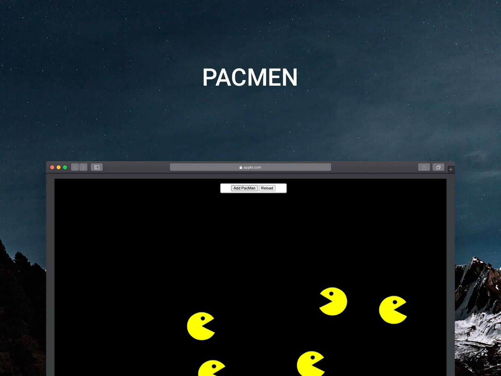

<div align="center" id="top"> 
  

  &#xa0;

  <!-- <a href="https://proyectosmit.netlify.app">Demo</a> -->
</div>

<!--<h1 align="center">Pacmen</h1>-->

<p align="center">
  <!-- -->

  <!-- -->

  <!-- -->

  <!-- -->

  <!--  -->

  <!--  -->

  <!--  -->
</p>

<!-- Status -->

<!-- <h4 align="center"> 
	🚧  ProyectosMIT 🚀 Under construction...  🚧
</h4> 

<hr> -->

<p align="center">
  <a href="#dart-about">About</a> &#xa0; | &#xa0; 
  <a href="#minidisc-How-to-run">How to Run</a> &#xa0; | &#xa0; 
  <a href="#tools-Roadmap-of-future-improvements">About</a> &#xa0; | &#xa0; 
  <a href="#sparkles-features">Features</a> &#xa0; | &#xa0;
  <a href="#rocket-technologies">Technologies</a> &#xa0; | &#xa0;
  <a href="#white_check_mark-requirements">Requirements</a> &#xa0; | &#xa0;
  <a href="#checkered_flag-starting">Starting</a> &#xa0; | &#xa0;
  <a href="#memo-license">License</a> &#xa0; | &#xa0;
  <a href="https://github.com/fukudamiyasato" target="_blank">Author</a>
</p>

<br>

## :dart: About ##

3 Proyecto web de "juego" donde puedes invocar "pacmens" para hacerlos rebotar usando los límites visibles de tu navegador como muros para el trabajo del curso de fullstack. (<a href="https://fukudamiyasato.github.io/MITPacmen" target="_blank">Link</a> )

## :minidisc: How to run ##

No necesita instalación especial, solo abrir el archivo index.html en un navegador web.

## :tools: Roadmap of future improvements ##

:black_circle: Botón para agregar un pacmen\

## :sparkles: Features ##

:heavy_check_mark: Botón para agregar un pacmen\
:heavy_check_mark: Botón para hacer que todos los pacmen se muevan\
:heavy_check_mark: Botón para resetear todos los pacmen;

## :rocket: Technologies ##

The following tools were used in this project:

- [HTML]
- [CSS]
- [JAVASCRIPT

## :white_check_mark: Requirements ##

Antes de empezar :checkered_flag:, necesitas tener [Git](https://git-scm.com) y [Node](https://nodejs.org/en/) instalado.

## :checkered_flag: Starting ##

```bash
# Clone this project
$ git clone https://github.com/fukudamiyasato/MITPacmen


# The server will initialize in the <http://localhost:3000>
```

## :memo: License ##

This project is under license from MIT. For more details, see the [LICENSE](LICENSE.md) file.


Hecho con :heart: por <a href="https://github.com/fukudamiyasato" target="_blank">Fukuda Miyasato</a>

&#xa0;

<a href="#top">Regresar</a>
